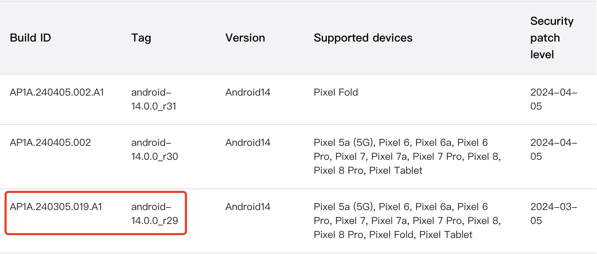
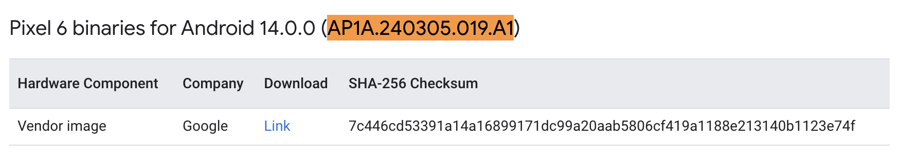
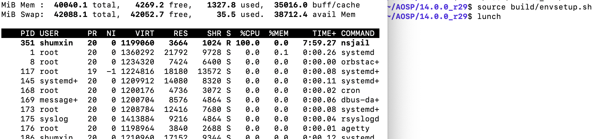
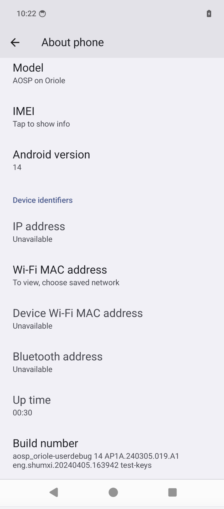

## 引言

> [自 2021 年 6 月 22 日起，我们不再支持在 Mac OS X 上构建新版 Android 平台。不过，旧版 Android 仍可在 Mac 上构建](https://source.android.com/docs/setup/start/requirements#os-requirements)。

所以目前在 ```Mac``` 上通常使用支持创建和使用 ```Linux®``` 容器的应用进行相应环境搭建，如 [```Docker```](https://www.docker.com/) 创建 [```Ubuntu```](https://ubuntu.com/) 环境后同步 [```AOSP```](https://source.android.com/docs/setup) 源码进行构建。本文使用了 [```OrbStack```](https://docs.orbstack.dev/)

> OrbStack is a fast, light, and simple way to run containers and Linux machines on macOS. It's a supercharged alternative to Docker Desktop and WSL, all in one easy-to-use app.

## 环境搭建和产物构建

### 创建 Ubuntu

查看 ```OrbStack``` 官方文档以及考虑到 ```arm``` 架构的 ```Ubuntu``` 编译可能存在未知问题，所以还是选择创建了 ```amd64``` 的 ```Ubuntu``` 环境

> On Apple Silicon, OrbStack uses Rosetta to run Linux machines with Intel (x86_64/amd64) binaries. This is much faster than emulation with QEMU or UTM, seamlessly providing near-native performance.

```bash
$ orb create --arch amd64 ubuntu new-ubuntu
```

```bash
$ uname -a
Linux new-ubuntu 6.7.11-orbstack-00143-ge6b82e26cd22 #1 SMP Sat Mar 30 12:20:36 UTC 2024 x86_64 x86_64 x86_64 GNU/Linux

$ cat  /etc/issue
Ubuntu 23.10 \n \l
```

### [安装相关依赖](https://source.android.com/docs/setup/start/requirements#install-packages)

做了如下变动
- ```git-core``` -> ```git```
- ```libncurses5``` -> ```libncurses5-dev```
- 增加了 ```rsync```，在后续编译过程中会需要

```bash
$ sudo apt-get install git gnupg flex bison build-essential zip curl zlib1g-dev libc6-dev-i386 libncurses5-dev x11proto-core-dev libx11-dev lib32z1-dev libgl1-mesa-dev libxml2-utils xsltproc unzip fontconfig rsync
```

### 同步源码

```bash
$ mkdir ~/bin
$ PATH=~/bin:$PATH
$ curl https://storage.googleapis.com/git-repo-downloads/repo > ~/bin/repo
$ chmod a+x ~/bin/repo
```

我使用[清华镜像源](https://mirrors.tuna.tsinghua.edu.cn/help/AOSP/)进行了代码同步，指定了 ```android-14.0.0_r29``` [```tag```](https://source.android.com/docs/setup/reference/build-numbers#source-code-tags-and-builds)

```bash
$ repo init -u https://mirrors.tuna.tsinghua.edu.cn/git/AOSP/platform/manifest -b android-14.0.0_r29
$ repo sync
```

同步过程中遇到了如下错误

```bash
error: Entry 'docs/release-process.md' not uptodate. Cannot merge.
```

则需要执行

```bash
$ cd .repo/repo
$ git pull
```

如果编译用于真机的固件则需要下载对应官方提供的[驱动程序二进制文件](https://developers.google.com/android/drivers)。比如我手上有个 ```Pixel 6``` 设备，则需要下载对应的文件用于后续的编译。在前面指定的 ```tag``` 标签的时候，官方对应 ```tag``` 有相应的 ```build id```。如 ```android-14.0.0_r29``` 对应的是 ```AP1A.240305.019.A1```





二进制文件压缩包下载下来后需要解压并执行释放相关内容

```bash
$ tar -xf google_devices-oriole-ap1a.240305.019.a1-8e8e1205.tgz
$ ./extract-google_devices-oriole.sh
```

### 编译

```bash
$ source build/envsetup.sh
$ lunch
```

执行 ```lunch``` 命令后会卡住，通过 ```top``` 命令查看 ```nsjail``` 进程 100% CPU



给 ```OrbStack``` 提了 issue 后很久没回复就谷歌了一番，看到有[博主](https://www.mobibrw.com/2024/39521)提供了最简单的重命名方案可解决问题。

```bash
$ mv prebuilts/build-tools/linux-x86/bin/nsjail prebuilts/build-tools/linux-x86/bin/nsjail.old
```

再次执行 ```lunch``` 后输入 ```aosp_oriole-trunk_staging-userdebug```

```bash
$ lunch

You're building on Linux

Warning: Cannot display lunch menu.

Note: You can invoke lunch with an explicit target:

  usage: lunch [target]

Which would you like? [aosp_arm-trunk_staging-eng]
Pick from common choices above (e.g. 13) or specify your own (e.g. aosp_barbet-trunk_staging-eng): aosp_oriole-trunk_staging-userdebug
21:53:44 Build sandboxing disabled due to nsjail error.
In file included from build/make/core/config.mk:389:
In file included from build/make/core/envsetup.mk:51:
build/make/core/release_config.mk:109: error: No release config found for TARGET_RELEASE: trunk_staging. Available releases are: ap1a.
21:53:44 dumpvars failed with: exit status 1
```

输入 ```aosp_oriole-trunk_staging-userdebug``` 是源于 ```device/google/raviole/AndroidProducts.mk``` 中有相关配置。未深究该问题，按 ```Available releases are: ap1a.``` 提示替换 ```aosp_oriole-ap1a-userdebug```

```bash
Build sandboxing disabled due to nsjail error.

============================================
PLATFORM_VERSION_CODENAME=REL
PLATFORM_VERSION=14
PRODUCT_INCLUDE_TAGS=com.android.mainline mainline_module_prebuilt_nightly
TARGET_PRODUCT=aosp_oriole
TARGET_BUILD_VARIANT=userdebug
TARGET_ARCH=arm64
TARGET_ARCH_VARIANT=armv8-2a
TARGET_CPU_VARIANT=cortex-a55
TARGET_2ND_ARCH=arm
TARGET_2ND_ARCH_VARIANT=armv8-a
TARGET_2ND_CPU_VARIANT=generic
HOST_OS=linux
HOST_OS_EXTRA=Linux-6.7.11-orbstack-00143-ge6b82e26cd22-x86_64-Ubuntu-23.10
HOST_CROSS_OS=windows
BUILD_ID=AP1A.240305.019.A1
OUT_DIR=out
============================================

Want FASTER LOCAL BUILDS? Use -eng instead of -userdebug (however for performance benchmarking continue to use userdebug)

Hint: next time you can simply run 'lunch aosp_oriole-ap1a-userdebug'
```

编译过程中会遇到

```bash
ERROR: Dex2oat failed to compile a boot image.It is likely that the boot classpath is inconsistent.Rebuild with ART_BOOT_IMAGE_EXTRA_ARGS="--runtime-arg -verbose:verifier" to see verification errors.
```

通过 [```WITH_DEXPREOPT=false```](https://stackoverflow.com/questions/60275623/android-dex2oat-builderror-dex2oat-failed-to-compile-a-boot-image) 关闭 ```dex2oat```

```bash
# 生成镜像文件
$ m WITH_DEXPREOPT=false

# 生成 ota.zip，我习惯于 recovery 模式下 adb sideload ota.zip 进行刷机
$ make otapackage -j64 WITH_DEXPREOPT=false
```

## 刷机

对应生成产物在 ```out/target/product/oriole/``` 目录下

- 通过 ```orb pull``` 将产物拉到宿主机器环境下

```bash
$ orb pull /home/shumxin/AOSP/14.0.0_r29/out/target/product/oriole/boot.img
$ orb pull /home/shumxin/AOSP/14.0.0_r29/out/target/product/oriole/dtbo.img
$ orb pull /home/shumxin/AOSP/14.0.0_r29/out/target/product/oriole/vendor_boot.img
$ orb pull /home/shumxin/AOSP/14.0.0_r29/out/target/product/oriole/aosp_oriole-ota.zip
```

- 刷写镜像

```bash
$ adb reboot booloader

$ fastboot flash boot boot.img
$ fastboot flash dtbo dtbo.img
$ fastboot flash vendor_boot vendor_boot.img
```

- 在 ```fastboot``` 模式下选择进入 ```recovery``` 模式
- 选择 ```Wipe data/factory reset``` 清除数据
- 清除完成后选择 ```Apply update from ADB```

```bash
$ adb sideload aosp_oriole-ota.zip
```




## 参考

- [1] [Install LineageOS on Google Pixel 6](
https://wiki.lineageos.org/devices/oriole/install/)
- [2] [macOS Sonoma(14.2.1)通过Docker编译Android 12.1源码过程总结(MacBook Pro 2023-Apple M2 Pro)](https://www.mobibrw.com/2024/39521)
- [3] [Android dex2oat build:ERROR: Dex2oat failed to compile a boot image](https://stackoverflow.com/questions/60275623/android-dex2oat-builderror-dex2oat-failed-to-compile-a-boot-image)
- [4] [OrbStack: macOS 上的 WSL](https://mp.weixin.qq.com/s/ByEBeZrCbvgP9Psto7rG0w)