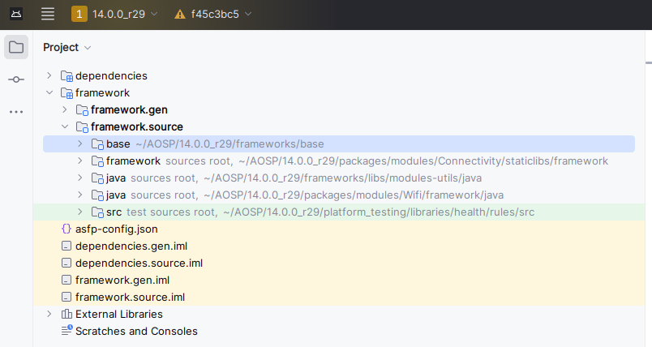
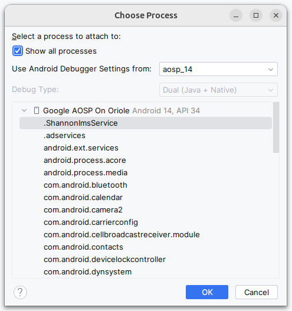

## 背景

在 [MacBook Pro M3 Max 上编译 AOSP](https://shumxin.github.io/2024/04/05/build-aosp-in-mackbook-pro-m3-max/) 的文章中提到了使用 ```OrbStack``` 进行 ```AOSP``` 项目编译，但是对于代码查看和调试不方便，用了 ```idea```, ```vscode``` 的 ```remote``` 方式都有些问题，还是选用官方推荐的 ```Ubuntu``` 配合 [```ASfP```](https://developer.android.com/studio/platform) 的方式更合适。

## 设备

硬盘 2 TB，源码加编译产物使用了差不多 900GB 多

|     |                   |
| :-- | :---------------- |
| CPU | Intel® Core™ i5 processor 14600KF 24M Cache |
| GPU | INNO3D GEFORCE RTX 4070 SUPER 曜夜OC |
| RAM | 芝奇 幻锋戟 32GB * 2 DDR5 6400 |
| HDD | 致态 TiPlus 7100 2TB NVMe M.2 PCIe4.0 |

## 编译

### 配置

针对 Pixel 6 编译，考虑到节省磁盘空间，移除了部分非必要项目。

在 ```.repo``` 目录下新增 ```local_manifests``` 目录，添加需要移除的项目的配置。后续 ```repo sync``` 就不会同步对应移除项目的代码。

```bash
$ mkdir -p .repo/local_manifests/
$ touch .repo/local_manifests/device_clean.xml
$ touch .repo/local_manifests/jdk_clean.xml
```

移除非 ```oriole```(```Pixel 6```) 未使用到的其他 ```device``` 项目

```device_clean.xml```

```xml
<?xml version="1.0" encoding="UTF-8"?>
<manifest>
  <remove-project path="device/amlogic/yukawa" name="device/amlogic/yukawa" groups="device,yukawa,pdk" />
  <remove-project path="device/amlogic/yukawa-kernel" name="device/amlogic/yukawa-kernel" groups="device,yukawa,pdk"  />
  <remove-project path="device/common" name="device/common" groups="pdk-cw-fs,pdk" />
  <remove-project path="device/generic/arm64" name="device/generic/arm64" groups="pdk" />
  <remove-project path="device/generic/armv7-a-neon" name="device/generic/armv7-a-neon" groups="pdk" />
  <remove-project path="device/generic/art" name="device/generic/art" groups="pdk" />
  <remove-project path="device/generic/car" name="device/generic/car" groups="pdk" />
  <remove-project path="device/generic/common" name="device/generic/common" groups="pdk" />
  <remove-project path="device/generic/mini-emulator-arm64" name="device/generic/mini-emulator-arm64" groups="pdk" />
  <remove-project path="device/generic/mini-emulator-armv7-a-neon" name="device/generic/mini-emulator-armv7-a-neon" groups="pdk" />
  <remove-project path="device/generic/mini-emulator-x86" name="device/generic/mini-emulator-x86" groups="pdk" />
  <remove-project path="device/generic/mini-emulator-x86_64" name="device/generic/mini-emulator-x86_64" groups="pdk" />
  <remove-project path="device/generic/opengl-transport" name="device/generic/opengl-transport" groups="pdk" />
  <remove-project path="device/generic/trusty" name="device/generic/trusty" groups="pdk" />
  <remove-project path="device/generic/uml" name="device/generic/uml" groups="device,pdk" />
  <remove-project path="device/generic/x86" name="device/generic/x86" groups="pdk" />
  <remove-project path="device/generic/x86_64" name="device/generic/x86_64" groups="pdk" />
  <remove-project path="device/generic/vulkan-cereal" name="device/generic/vulkan-cereal" groups="pdk" />
  <remove-project path="device/google/atv" name="device/google/atv" groups="device,broadcom_pdk,generic_fs,pdk" />
  <remove-project path="device/google/barbet" name="device/google/barbet" groups="device,barbet" />
  <remove-project path="device/google/barbet-sepolicy" name="device/google/barbet-sepolicy" groups="device,barbet" />
  <remove-project path="device/google/bluejay" name="device/google/bluejay" groups="device,bluejay" />
  <remove-project path="device/google/bluejay-sepolicy" name="device/google/bluejay-sepolicy" groups="device,bluejay" />
  <remove-project path="device/google/bluejay-kernel" name="device/google/bluejay-kernel" groups="device,bluejay"  />
  <remove-project path="device/google/bramble" name="device/google/bramble" groups="device,bramble" />
  <remove-project path="device/google/bramble-sepolicy" name="device/google/bramble-sepolicy" groups="device,bramble" />
  <remove-project path="device/google/contexthub" name="device/google/contexthub" groups="device,pdk" />
  <remove-project path="device/google/coral" name="device/google/coral" groups="device,coral,generic_fs" />
  <remove-project path="device/google/coral-kernel" name="device/google/coral-kernel" groups="device,coral,generic_fs"  />
  <remove-project path="device/google/coral-sepolicy" name="device/google/coral-sepolicy" groups="device,coral,generic_fs" />
  <remove-project path="device/google/felix" name="device/google/felix" groups="device,felix" />
  <remove-project path="device/google/felix-sepolicy" name="device/google/felix-sepolicy" groups="device,felix" />
  <remove-project path="device/google/felix-kernel" name="device/google/felix-kernel" groups="device,felix"  />
  <remove-project path="device/google/gs201" name="device/google/gs201" groups="device,cloudripper" />
  <remove-project path="device/google/gs201-sepolicy" name="device/google/gs201-sepolicy" groups="device,cloudripper" />
  <remove-project path="device/google/lynx" name="device/google/lynx" groups="device,lynx" />
  <remove-project path="device/google/lynx-sepolicy" name="device/google/lynx-sepolicy" groups="device,lynx" />
  <remove-project path="device/google/lynx-kernel" name="device/google/lynx-kernel" groups="device,lynx"  />
  <remove-project path="device/google/pantah" name="device/google/pantah" groups="device,cloudripper" />
  <remove-project path="device/google/pantah-sepolicy" name="device/google/pantah-sepolicy" groups="device,cloudripper" />
  <remove-project path="device/google/pantah-kernel" name="device/google/pantah-kernel" groups="device,cloudripper"  />
  <remove-project path="device/google/redbull" name="device/google/redbull" groups="device,redbull" />
  <remove-project path="device/google/redbull-kernel" name="device/google/redbull-kernel" groups="device,bramble,redfin"  />
  <remove-project path="device/google/redbull-sepolicy" name="device/google/redbull-sepolicy" groups="device,redbull" />
  <remove-project path="device/google/redfin" name="device/google/redfin" groups="device,redfin" />
  <remove-project path="device/google/redfin-sepolicy" name="device/google/redfin-sepolicy" groups="device,redfin" />
  <remove-project path="device/google/tangorpro" name="device/google/tangorpro" groups="device,tangorpro" />
  <remove-project path="device/google/tangorpro-sepolicy" name="device/google/tangorpro-sepolicy" groups="device,tangorpro" />
  <remove-project path="device/google/tangorpro-kernel" name="device/google/tangorpro-kernel" groups="device,tangorpro"  />
  <remove-project path="device/google/shusky" name="device/google/shusky" groups="device,ripcurrent" />
  <remove-project path="device/google/shusky-kernel" name="device/google/shusky-kernel" groups="device,ripcurrent"  />
  <remove-project path="device/google/shusky-sepolicy" name="device/google/shusky-sepolicy" groups="device,ripcurrent" />
  <remove-project path="device/google/sunfish" name="device/google/sunfish" groups="device,sunfish" />
  <remove-project path="device/google/sunfish-kernel" name="device/google/sunfish-kernel" groups="device,sunfish"  />
  <remove-project path="device/google/sunfish-sepolicy" name="device/google/sunfish-sepolicy" groups="device,sunfish" />
  <remove-project path="device/google/trout" name="device/google/trout" groups="device,trout,gull,pdk" />
  <remove-project path="device/google/vrservices" name="device/google/vrservices" groups="pdk" />
  <remove-project path="device/google/zuma" name="device/google/zuma" groups="device,ripcurrent" />
  <remove-project path="device/google/zuma-sepolicy" name="device/google/zuma-sepolicy" groups="device,ripcurrent" />
  <remove-project path="device/google_car" name="device/google_car" groups="pdk" />
  <remove-project path="device/linaro/dragonboard" name="device/linaro/dragonboard" groups="device,dragonboard,pdk" />
  <remove-project path="device/linaro/dragonboard-kernel" name="device/linaro/dragonboard-kernel" groups="device,dragonboard,pdk"  />
  <remove-project path="device/linaro/hikey" name="device/linaro/hikey" groups="device,hikey,pdk" />
  <remove-project path="device/linaro/hikey-kernel" name="device/linaro/hikey-kernel" groups="device,hikey,pdk"  />
  <remove-project path="device/linaro/poplar" name="device/linaro/poplar" groups="device,poplar,pdk" />
  <remove-project path="device/linaro/poplar-kernel" name="device/linaro/poplar-kernel" groups="device,poplar,pdk"  />
</manifest>
```

移除部分 ```jdk```

```jdk_clean.xml```

```xml
<?xml version="1.0" encoding="UTF-8"?>
<manifest>
  <remove-project path="prebuilts/jdk/jdk11" name="platform/prebuilts/jdk/jdk11" groups="pdk"  />
  <remove-project path="prebuilts/jdk/jdk9" name="platform/prebuilts/jdk/jdk9" groups="pdk"  />
</manifest>
```

### 耗时

其中 ```-j``` 指定了 12，其他任务并行执行电脑也不感觉到卡顿。耗时 1小时 10 分钟完成。

```bash
$ make otapackage -j12 WITH_DEXPREOPT=false
```

```bash
2024-05-01 10:26:01 - common.py - INFO    :   Running: "java -Xmx4096m -Djava.library.path=out/host/linux-x86/lib64 -jar out/host/linux-x86/framework/signapk.jar -w build/make/target/product/security/testkey.x509.pem build/make/target/product/security/te
stkey.pk8 /home/shumxin/AOSP/14.0.0_r29/out/soong/.temp/tmpsmayeaza.zip out/target/product/oriole/aosp_oriole-ota.zip"
2024-05-01 10:26:03 - ota_from_target_files.py - INFO    : done.

#### build completed successfully (01:10:17 (hh:mm:ss)) ####
```

## 调试

导入 ```ASfP```




在 ```android 14``` 上如果编译的固件类型是 ```userdebug```，发现无法 ```attach process``` 进行 ```debug```。

官方 [```commit```](https://android.googlesource.com/platform/frameworks/base.git/+/0fc653c307807c41fbc876b3c117427de687e1c2%5E%21/#F1) 如下

```java
diff --git a/core/java/com/android/internal/os/Zygote.java b/core/java/com/android/internal/os/Zygote.java
index b1e7d15..deafd19 100644
--- a/core/java/com/android/internal/os/Zygote.java
+++ b/core/java/com/android/internal/os/Zygote.java
@@ -1001,16 +1001,24 @@
     }
 
     /**
+     * This will enable jdwp by default for all apps. It is OK to cache this property
+     * because we expect to reboot the system whenever this property changes
+     */
+    private static final boolean ENABLE_JDWP = SystemProperties.get(
+                          "persist.debug.dalvik.vm.jdwp.enabled").equals("1");
+
+    /**
      * Applies debugger system properties to the zygote arguments.
      *
-     * If "ro.debuggable" is "1", all apps are debuggable. Otherwise,
-     * the debugger state is specified via the "--enable-jdwp" flag
-     * in the spawn request.
+     * For eng builds all apps are debuggable. On userdebug and user builds
+     * if persist.debuggable.dalvik.vm.jdwp.enabled is 1 all apps are
+     * debuggable. Otherwise, the debugger state is specified via the
+     * "--enable-jdwp" flag in the spawn request.
      *
      * @param args non-null; zygote spawner args
      */
     static void applyDebuggerSystemProperty(ZygoteArguments args) {
-        if (RoSystemProperties.DEBUGGABLE) {
+        if (Build.IS_ENG || ENABLE_JDWP) {
             args.mRuntimeFlags |= Zygote.DEBUG_ENABLE_JDWP;
         }
     }
```

通过如下配置可开启 ```debug``` 进行应用调试

```bash
$ adb root
$ adb shell setprop persist.debug.dalvik.vm.jdwp.enabled 1
$ adb reboot
```




## 参考

- [1] [Android Studio for Platform](https://developer.android.com/studio/platform)
- [2] [Android Local Manifests机制的使用实践](https://duanqz.github.io/2016-04-15-Android-Local-Manifests-Practice)
- [3] [使用 ASfP 搭建 Android Framwork 开发调试阅读环境](https://juejin.cn/post/7316927971095576630)