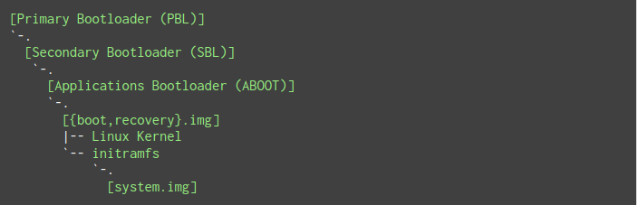

## 背景

过去看了一些大牛关于 ```Android Framework``` 的相关文章，一直想自己梳理相关的内容。计划 ```Framework``` 开篇是 【```Android``` 系统启动】，但是想想还是先整理一篇关于安卓系统启动前的文章。

## 启动流程

> [Upon power up, hardware usually starts uninitialized. To continue booting, the system may need to read a bootloader from some peripheral device. It is often easier to implement routines for reading from external storage devices in software than in hardware. A boot ROM provides a place to store this initial loading code, at a fixed location immediately available to the processor when execution starts.](https://en.wikipedia.org/wiki/Boot_ROM#Purpose)。

> 上电后，硬件通常以未初始化的方式启动。要继续引导，系统可能需要从某些外围设备读取引导加载程序。在软件中实现从外部存储设备读取的例程通常比在硬件中更容易。引导 ```ROM``` 提供了一个存储此初始加载代码的位置，该位置位于执行开始时处理器立即可用的固定位置。

### Bootloader(BL)

早期的 ```Android``` 设备并未对 ```boot.img```，```system.img``` 等进行可靠性校验，用户可通过获取临时 ```root``` 权限后对系统进行修改。```4.4``` 时期安卓引入了 [Verified Boot](https://source.android.com/docs/security/features/verifiedboot)，但是其也依赖前面阶段的校验。整个校验链路中某个环节被攻击都会无法保证后面阶段的可靠性，而 ```BL``` 正是这个链路中至关重要的一环。

目前的市面上的安卓设备通常有多个引导加载程序阶段，其中一个引导加载程序启动另一个引导加载程序，阶段中的每个引导加载程序都会执行特定的功能，并且每个引导加载程序都由前一个引导加载程序（例如，主引导加载程序 （PBL） →辅助引导加载程序 （SBL） → ...） 进行验证。依此类推，直到内核加载。


#### Primary Bootloader(PBL)

信任链中的第一个引导加载程序就是 ```PBL```，存储在不可变的只读存储器中，其可确保无法被物理修改，因此是受信任的。

#### Secondary Bootloader(SBL)

```SBL``` 是紧接 ```PBL``` 后面的引导加载程序，```PBL``` 校验 ```SBL``` 可靠后会对其进行加载。

对于使用高通芯片的安卓设备，在较新的处理器上，```SBL``` 被 ```XBL``` （```eXtensible Boot Loader```）取代。

```SBL``` 负责芯片驱动及充电等核心应用功能等初始化

#### Applications Bootloader(ABL)

```ABL``` 包括芯片无关的应用如 ```fastboot```，并接收 ```XBL``` 一些初始化的信息并将其传递至 ```kernel```。同样 ```ABL``` 会验证 ```boot``` 或者 ```recovery``` 映像的真实性。

### Kernel

```Android``` 内核是基于 ```Linux``` 内核的修改版本，内核启动过程中会执行 ```init``` 可执行文件后创建 ```init``` 进程，```init``` 会通过解析 ```init.rc``` 来启动 ```zygote``` 服务，而 ```zygote``` 又会启动会创建 ```system_server``` 进程。```Android``` 的系统启动则是从 ```Android``` 内核启动开始。




## 参考

- [1] [Boot ROM](https://en.wikipedia.org/wiki/Boot_ROM)
- [2] [Booting process of Android devices](https://en.wikipedia.org/wiki/Booting_process_of_Android_devices)
- [3] [Qualcomm’s Chain of Trust](https://lineageos.org/engineering/Qualcomm-Firmware/)
- [4] [Secure Boot and Image Authentication](https://www.qualcomm.com/content/dam/qcomm-martech/dm-assets/documents/secure-boot-and-image-authentication-version_final.pdf)
- [5] [Qualcomm® Secure boot Prevents malicious software from loading during the system start-up process of Inforce platforms](https://www.penguinsolutions.com/company/resources/newsroom/qualcomm-secure-boot)
- [6] [Analysis of Qualcomm Secure Boot Chains](https://blog.quarkslab.com/analysis-of-qualcomm-secure-boot-chains.html)
- [7] [Emulating the Android Boot Process](https://www.osti.gov/servlets/purl/1890781)
- [8] [Bypassing Nexus 6 Secure Boot through Kernel Command-line Injection](https://alephsecurity.com/2017/05/23/nexus6-initroot/)
- [9] [Bootloader overview](https://source.android.com/docs/core/architecture/bootloader)
- [10] [Verified Boot](https://source.android.com/docs/security/features/verifiedboot)
- [11] [Android Boot Process](https://www.geeksforgeeks.org/android-boot-process/)
- [12] [Secure Boot 2.2 安全启动](https://trust.mi.com/docs/miui-security-white-paper-global/2/2)
- [13] [浅谈 Android 的安全启动和完整性保护](https://evilpan.com/2020/11/14/android-secure-boot/)
- [14] [当我们谈论解锁 BootLoader 时，我们在谈论什么？](https://weishu.me/2021/07/24/what-is-bootloader-unlock/?hmsr=joyk.com&utm_source=joyk.com&utm_medium=referral)
- [15] [Android【开机启动】流程](https://www.cnblogs.com/yuanqiangfei/p/16802086.html)